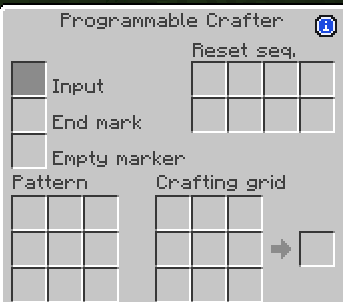
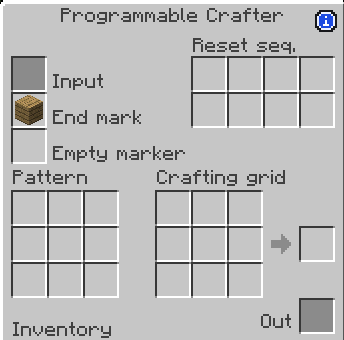
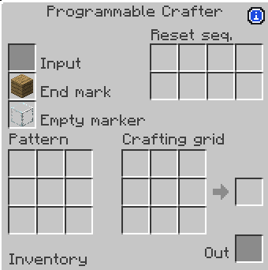
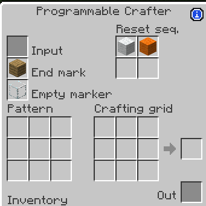
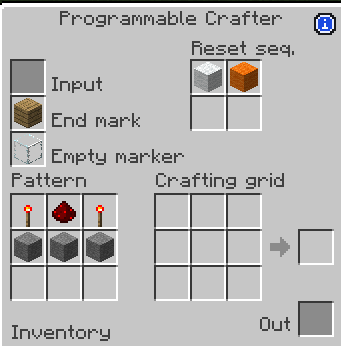

Autoverse is a mod about automation and programming - Not with codes, but with items!

For further informations, please visit the mod's CF page:
[https://www.curseforge.com/minecraft/mc-mods/autoverse](https://www.curseforge.com/minecraft/mc-mods/autoverse)

The programmable crafter is a typical programmable block from autoverse, and it can save you a lot of trouble if properly used.
The GUI is rather complicated, but no panic! This guide will explain it to you bit by bit.

Before using, the crafter needs to be programmed with a series of items, either introduced manually or by other automation mechanisms.
The slot on the top left is where you put item in. The first item introduced represents the "End mark". This serves as a marker when you finished part of the programming, and any item or block can be used.
The empty marker is the item that represents the empty slots in a 3x3 crafting grid, only serves in programming.
The Reset sequece is a series of item that can be introduced during normal operation to "Reset" the crafter to its unprogrammed state, which allows the crafter (and literally every programmable block in Autoverse) to be repurposed by automation.
In the end, the pattern part is where you program your recipe and crafting grid is where the crafter stores ingredients.

Now, let's try to program it to make a redstone repeater:
First, for the end marker, we can choose a item that does not exist in RS repeater's recipe. Oak plank is used here, introduce it via the top-left slot.

Next the empty marker, We use another useless item, glass. It should be different as the end marker.

For the reset sequence, it can be a single or multiple unused item, here we use white and orange wool. After inserting these 2 wool blocks, another "End marker" (oak plank) item needs to be introduced to mark the end of the reset sequence.

Now we can start programming our recipe. Items should be introduced from left to right and top to bottom, and use the "Empty Marker" item (glass) to fill the empty cases.
The sequence should be rs torch -> redstone -> rs torch -> stone -> stone -> stone -> glass -> glass -> glass

After filling the pattern, empty marker items will disapper, which shows successful completion of programming. Now you can start pumping in ingredients for autocrafting!
Item in the output slot can be extracted automatically only from the side with orange corners. All non-maching items will be passed to the output slot instead of blocking the input, which allows the crafter to serve as a filter. This is very useful if you want to automated BWM saw with simple hopper automation.
You can also copy the programming sequece to be used later with the Wand of the Lazy Sequencer.