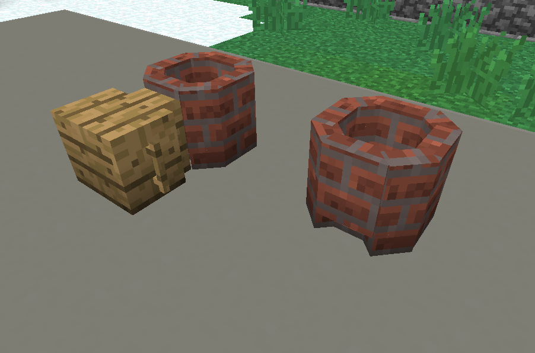

Official wiki:
[https://sites.google.com/view/forgecraft/home/wiki](https://sites.google.com/view/forgecraft/home/wiki)

A complete video spotlight can be found here:
[https://www.youtube.com/watch?v=VUrflhR466c&list=PLgO-MCfI2nu4RLJUX-ikkDiA-XTI8cvrp](https://www.youtube.com/watch?v=VUrflhR466c&list=PLgO-MCfI2nu4RLJUX-ikkDiA-XTI8cvrp)

Currently there is a bug with this mod's JEI handler which prevents showing scrap metal's usage by pressing U on them. Press U on the crucible instead to see a full list of recipes.

To begin, place your bloomery like this

Load the bloomery with enough charcoal and ignite it with Fire bow.

To load the crucible, it needs to be placed on the ground and insert items by rightclicking. Then the crucible can be transfered into the bloomery using stone tongs.

Pull the bellow until it reaches desired temperature and when finished, put the crucible back on the ground for cooling.  

When cooled, break the crucible with a pickaxe to get products.

Please refer to the official wiki for tool creation tutorial, note that stone anvil is now created via normal crafting instead of in-world crafting.
